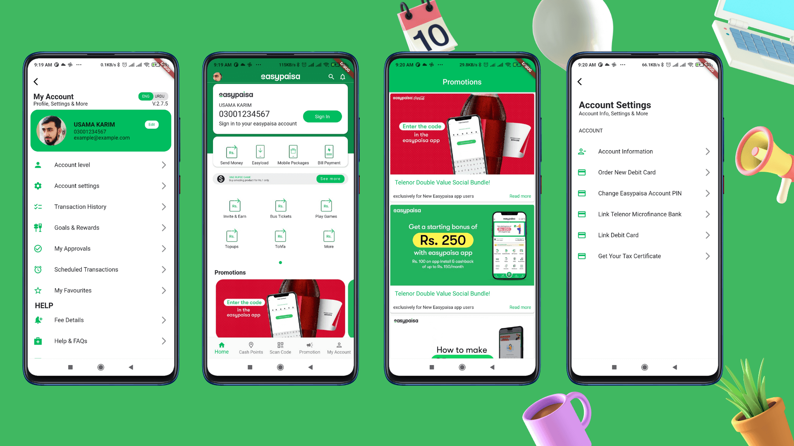
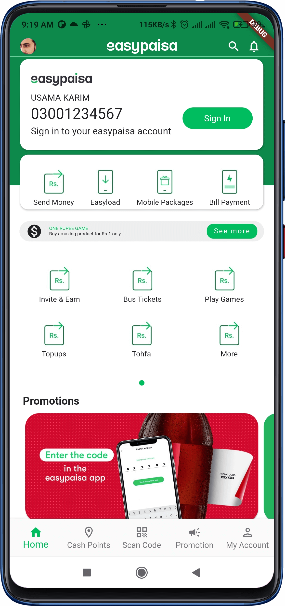
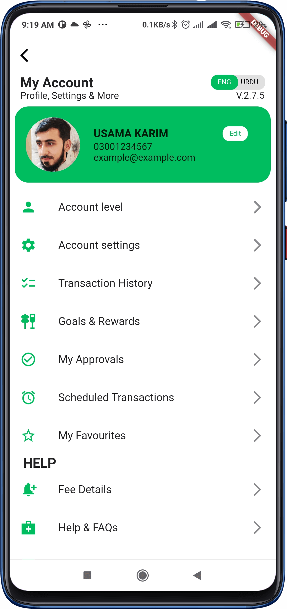
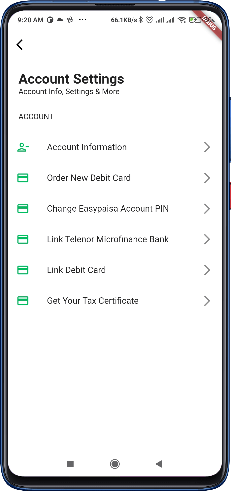

## EasyPaisa UI
Pixel Perfect UI of EasyPaisa Application

<p align="center">
    
</p>

## Screenshots
|                                      |                                      |
| ------------------------------------ | ------------------------------------ |
|  |  |
|            Easypaisa Home            |          My account screen           |
|   |   |
|           Promotion screen           |        Account settings screen       |

## Usage 🎨
To clone and run this application, you'll need [git](https://git-scm.com) and [flutter](https://flutter.dev/docs/get-started/install) installed on your computer. From your command line:

```bash
# Clone this repository
$ git clone https://github.com/UsamaKarim/easypaisa.git

# Go into the repository
$ cd easypaisa

# Install dependencies
$ flutter packages get

# Run the app
$ flutter run
```
